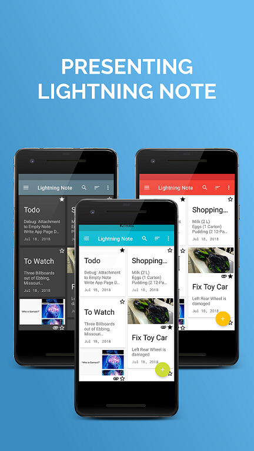
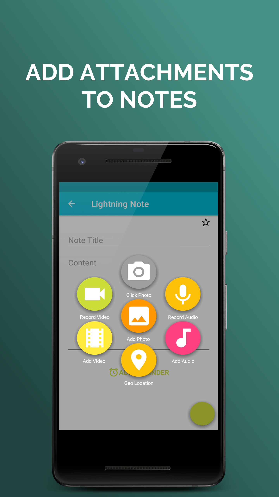
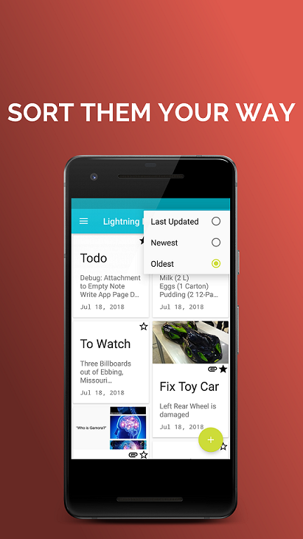
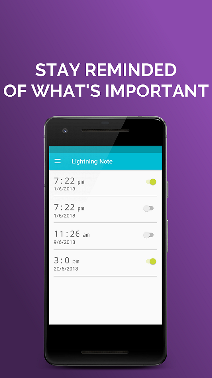
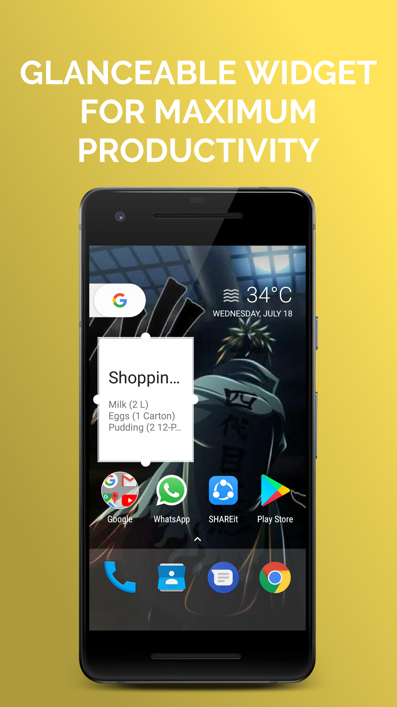

# Lightning Note

Lightning Note aims to be a *lightweight* but still *powerful*, *open-source* note making (notepad) application.

The primary purpose of this application was to be a different sort of Notepad, one that *comes to the user*. So the user just has to **shake the phone twice** and the app will open itself.
The App also aims to implement a *Floating Note Helper* for phones without the accelerometer installed for detecting shaking action.

## Features

Ever found yourself needing to urgently jot something and finding your stupid smartphone hell bent on hiding your notepad ?? Ever felt like life would be so much easier if you didn't have to hunt through your app drawer for apps ? Well, Your wait is Over!! Presenting Lightning Note, a lightweight solution to your note making problems.

<b>No More Searching for the App</b>
Gone are the days when you'd look for the app inside your drawer or scroll multiple screens only to find you missed the app. Just Shake the phone twice and <i>Presto!!</i> the App comes to you. If shaking is not your style, then you may choose to have our floating window helper let you note anywhere you want with ease and convenience.

<b>Simple and Intuitive Design with Multiple Themes</b>
Lightning Note takes advantage of Google's Material Design style to create a compelling and easy to use note making experience. The App supports 7 material themes so take your pick.

<b>Not Just Text</b>
Vanilla Text is so passé, Lightning Note comes with out of the box support for adding more than just Text to your notes.
Annotate your notes with: &#8226;&#8195;Images &#8226;&#8195;Video &#8226;&#8195;Audio &#8226;&#8195;Location 
<b>Find important things faster</b>
Whether it be starring your notes so you keep track of them, sorting them in order of creation/updation or just straight up searching for them using text, We've got you covered.

<b>Add Reminders for better Productivity</b>
Find yourself forgetting important things you had to do ? Just add a note and click on Reminder. You can set optional instruction text for the reminder and set its priority. We'll take care of the rest ;)

<b>Home Screen Widget</b>
Save you most important notes to homescreen and have easy access to them outside of app.

## Contributing

If you wish to contribute just clone the project, find a feature/bug to work on and open a pull request. Upon successful submission of PR I will review it as soon as possible and may get in touch regarding specifics of the work done. Once your pull request has been accepted, I will update your name in the developed by list here (or you may choose to do so yourself if I forget).

**Thank you for taking interest in my project and I hope you choose to improve it with your insight!!**

## </> With &#x2764; By

* [nihitb06](https://github.com/nihitb06)

## Privacy Policy

A copy of the App Privacy Policy can be found [here](https://www.freeprivacypolicy.com/privacy/view/fac0d31948ed488fcd947f108f33f7ee)
